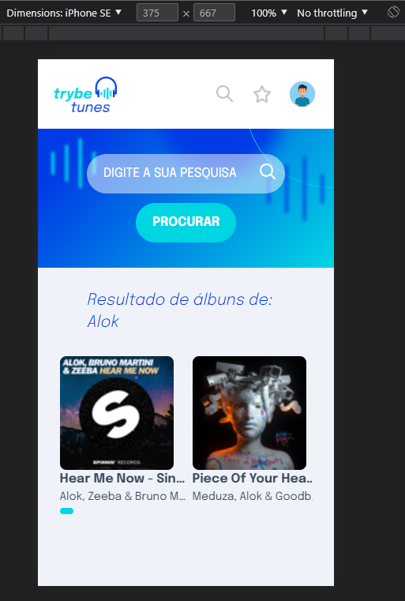
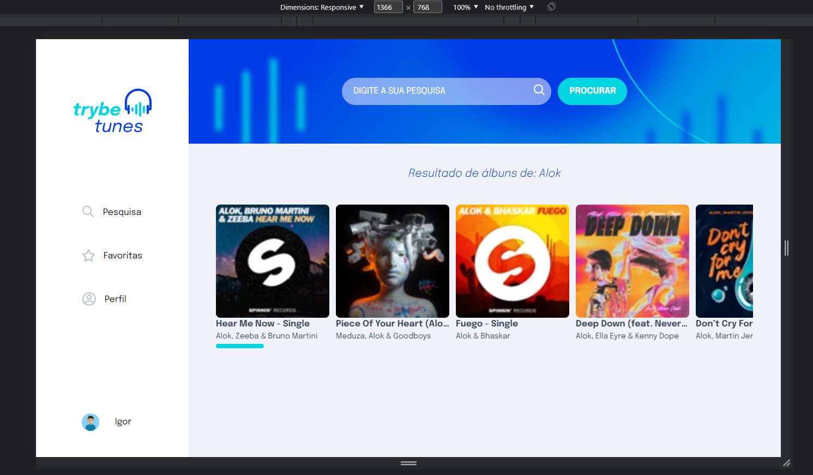

  <h1>Trybetunes</h1>
  

    <a href="https://igorsilvaj.github.io/trybetunes">Demonstração</a>
    ·
    <a href="https://github.com/igorsilvaj/trybetunes/issues">Reporte um Bug</a>
  

## Sobre o projeto

Desenvolvido durante o curso de Front-end da Trybe.

Esta aplicação consegue buscar álbuns que estão disponíveis no Itunes, podendo abrir o álbum e escutar trechos das músicas, adicionar músicas à lista de favoritos e personalizar perfil do usuário.

Site criado com foco na biblioteca React, sendo uma SPA com rotas fornecidas pelo React Router.

Experimentei utilizar o framework Tailwind pela primeira vez neste projeto, realizei a estilização com o conceito de mobile first tentando deixar o site o mais responsivo possível.

 

## Mobile

## Desktop

